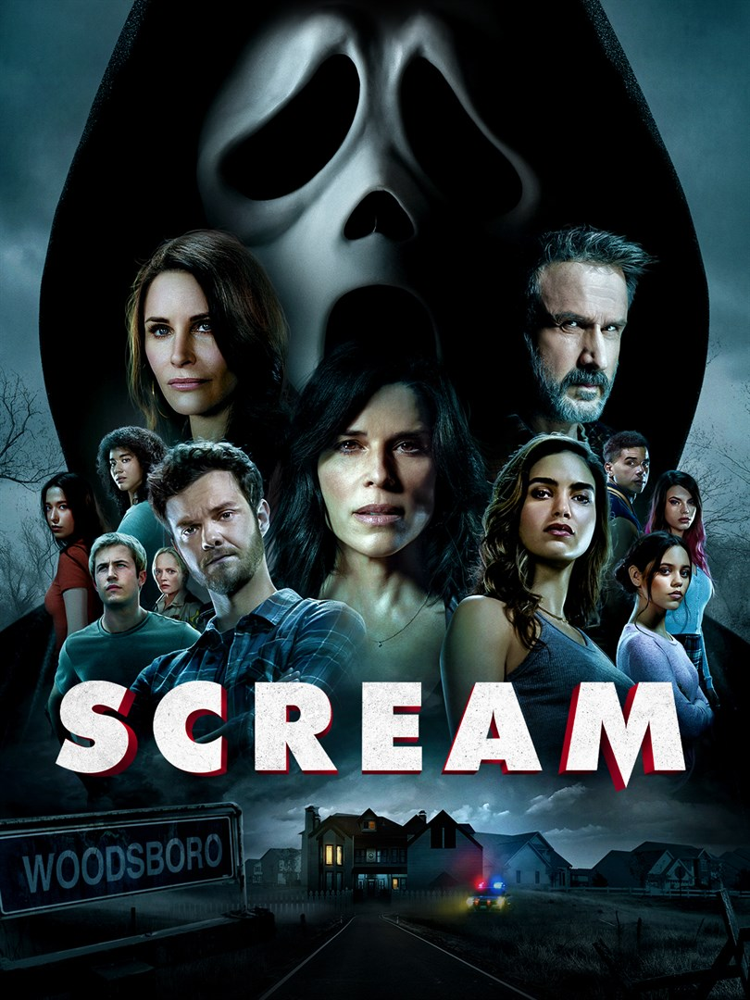
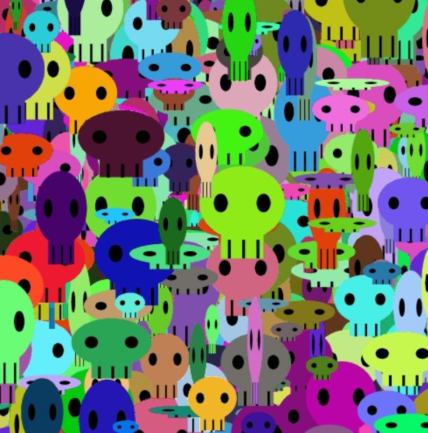
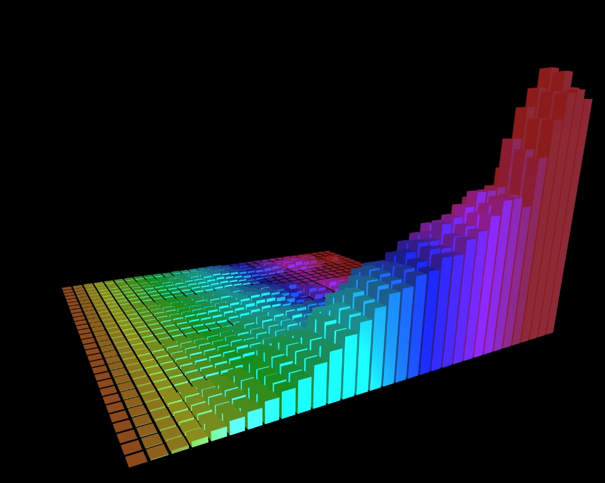

# wwan8482_9103_tut6_Quiz 8

## **Part 1: Imaging Technique Inspiration**

### **Frighten Elements**
"The Scream" painted by Edvard Munch in artworks is a work I want to redesign. As the title of this work says, related words such as "horror", "scream" and "ghost" came to my mind. Then I remembered that the classic horror movie "SCREAM" uses screams to create a scary atmosphere.

### **Animation**
Since there is sound interaction, there must also be movement changes. I hope to add an additional "ghost is floating" element to "The Scream".

### **Part 1 Conclusion**
Based on this inspiration, my concept is for the user to make the characters in "The Scream" shake violently through the sound they make, and then floating ghosts will continue to appear in the image. The louder the user makes. The more frequently a character shakes, the more ghosts appear. I felt like this idea fit well with the theme of this artwork, creating an immersive horror atmosphere through a combination of sound and animation.

## **Part 2: Coding Technique Exploration**

### **Audio imaging, analysis and processing**

What I chose is sound interactive imaging technology.
First, load the "The Scream" image file through the "preload" function. Use "p5.AudioIn" to obtain the user's voice input, and use "p5.Amplitude" to analyze the user's voice information. In the draw function, obtain the amplitude value of the sound through amplitude.getLevel. Next, create an image dithering effect by randomizing the position of the image, and making the dithering effect positively related to the sound amplitude value. Using the same method, generate additional ghost images. Ultimately making the entire piece interactive based on the user's voice.

Reference:

Ghost: https://happycoding.io/tutorials/p5js/animation/ghost

SCREAM: https://www.microsoft.com/en-au/p/scream/8d6kgwxn64w1?activetab=pivot%3aoverviewtab

FFT Music Visualizer - a source of inspiration for users' sounds: https://www.dynamicmath.xyz/math2400/sketches/fft/

Function use in coding: https://p5js.org/zh-Hans/reference/#/p5.AudioIn

Function use in coding: https://p5js.org/zh-Hans/reference/#/p5.Amplitude

